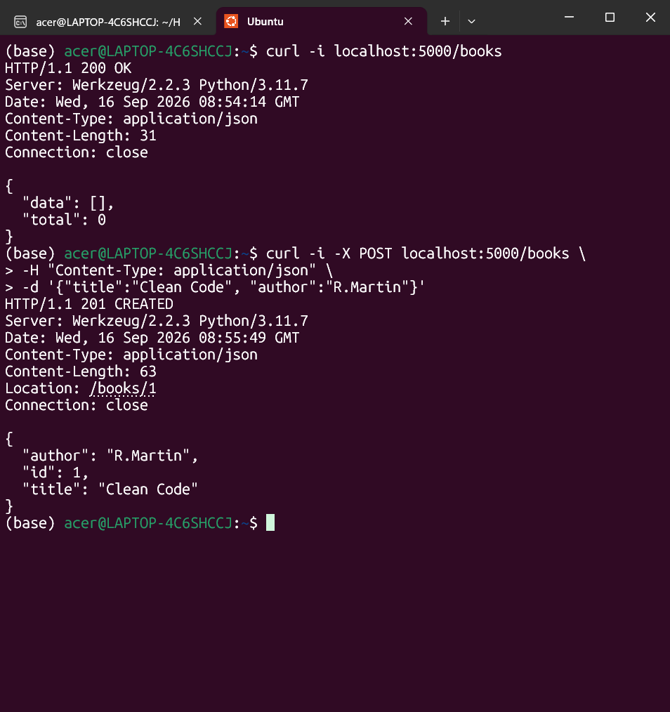
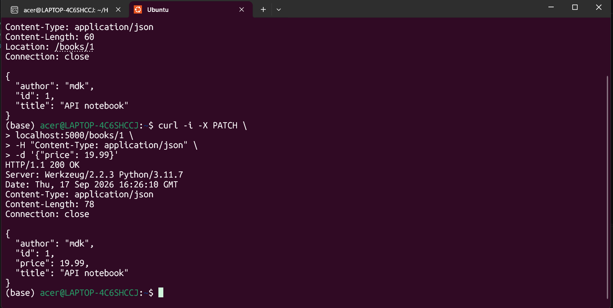
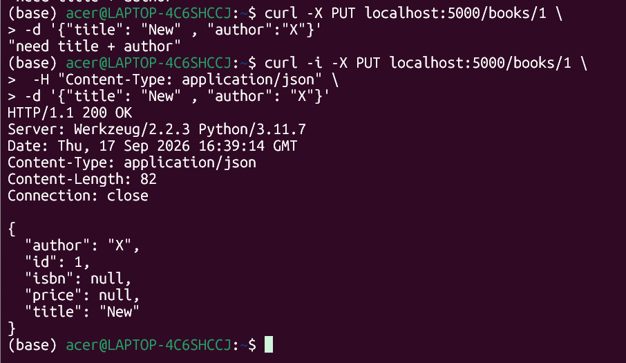
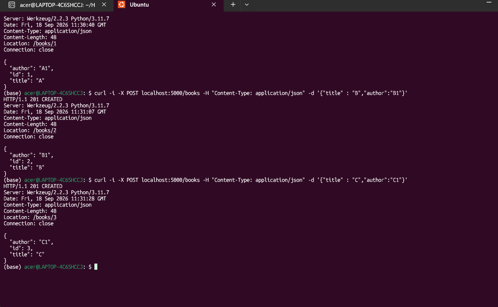
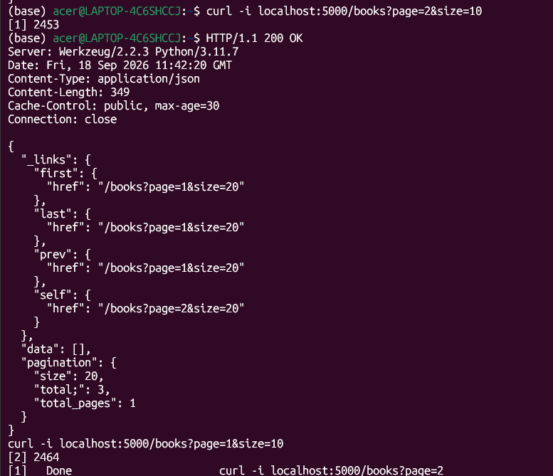
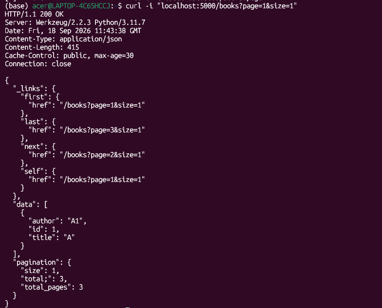
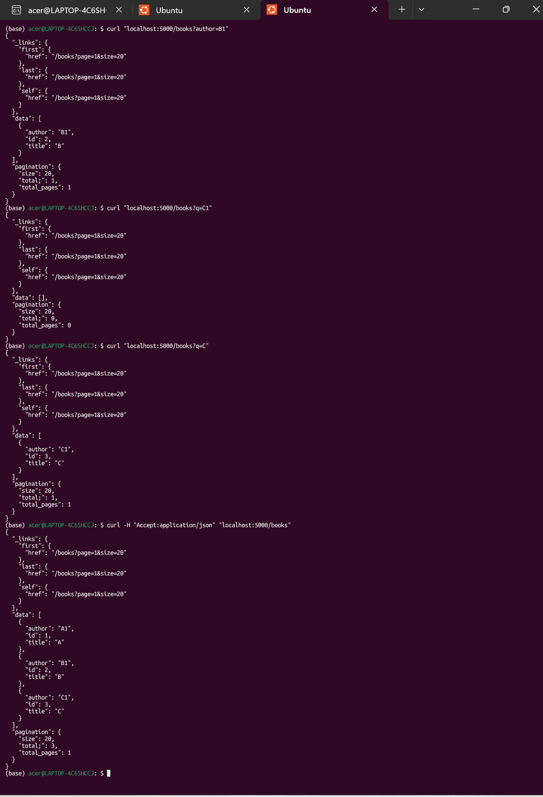

# Nội bài tập thực hành tuần 2

**1. Bài 1**

* Cơ chế hoạt động
  - GET : đưa ra danh sách các quyển sách đã được lưu trong danh sách (list) BOOKS[]
  - POST : thêm một quyển sách mới vào BOOKS[] với hai trường yêu cầu bắt buộc là title và author

**2. Bài 2**

* Phương thức PATCH là cập nhật một phần , tính idempotent có thể có hoặc không tùy theo cách cập nhật:
  - Nếu cập nhật theo kiểu giống PUT : gán dữ liệu vào đúng vị trí -> idempotent
  - Nếu cập nhật thông tin để hàm xử lý : ví dụ như deposit(n) nạp n đồng vào tài khoản , khi này số dư tài khoản đều thay đổi sau mỗi lần nạp chứ ko bất biến dù vẫn hàm đó
    

* Phương thức PUT luôn là thỏa idempotent ( thỏa tính lũy đẳng) bởi PUT phải tuân thủ yêu cầu:
  - Trạng thái của tài nguyên mục tiêu được tạo mới (set vào vị trí)
  - Hoặc thay thế bằng trạng thái được định nghĩa trong nội dung request
  - Các trường mà PUT không nêu sẽ mặc định được PUT nêu là null ( cần lưu ý , nếu PUT một phần dữ liệu sẽ làm cho các trường không được nêu thành null)

* Phương thức DELETE luôn thỏa idempotent

**3. Bài 3**
* Nâng cấp GET/books thành một production-ready ( một sản phẩm được triển khai )
  - Có filtering để lọc  books?page =  & size =
  - Có HATEOAS link để chỉ dẫn người dùng
  - Cache-Control để lưu Cache
  - Có Pagination ( thuật toán phân trang) để phân chia thành các page với size phù hợp

