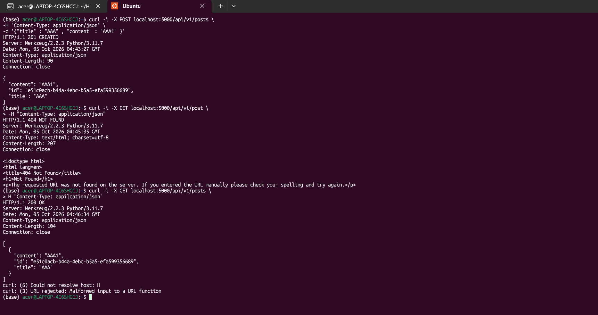
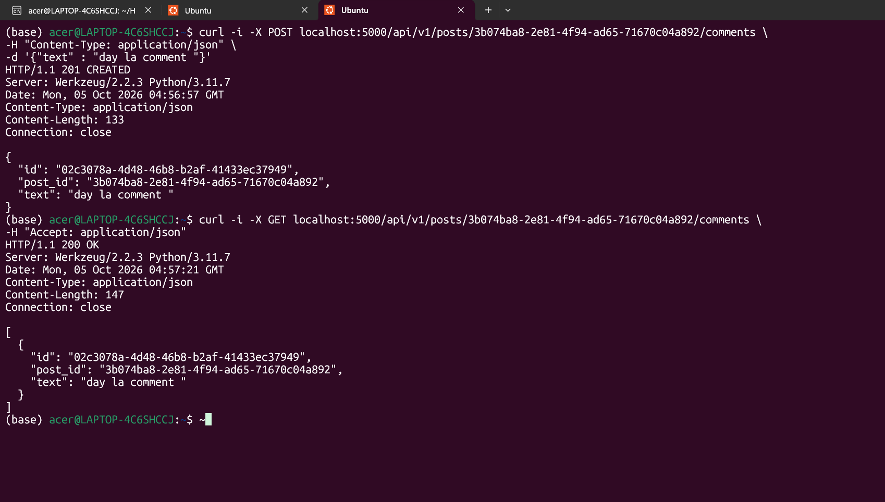
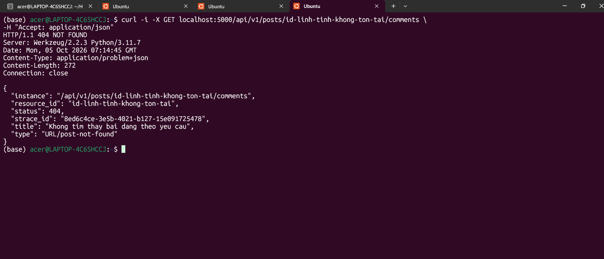
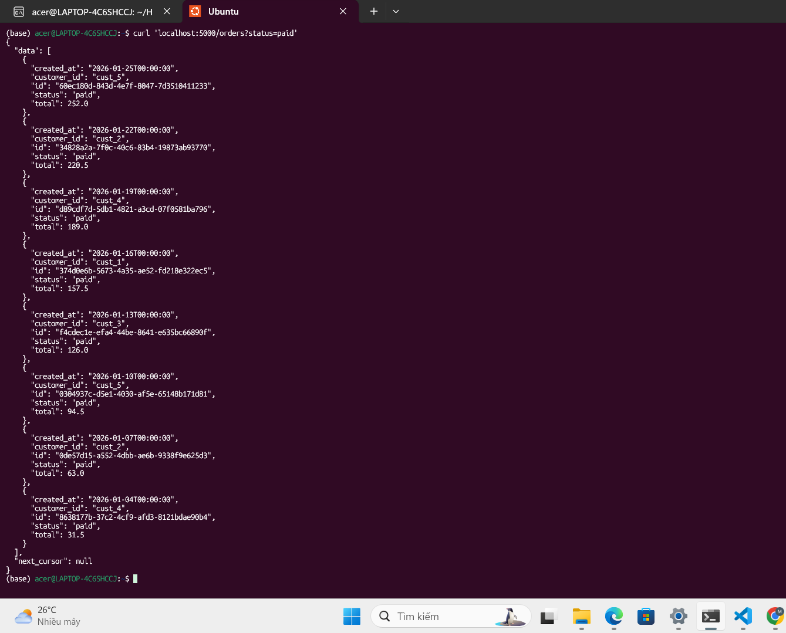
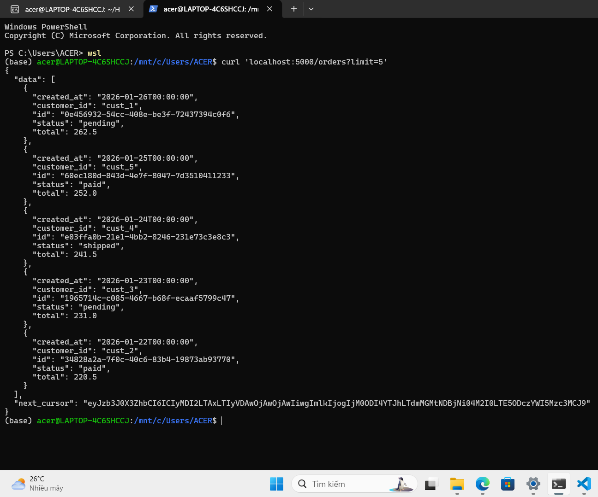
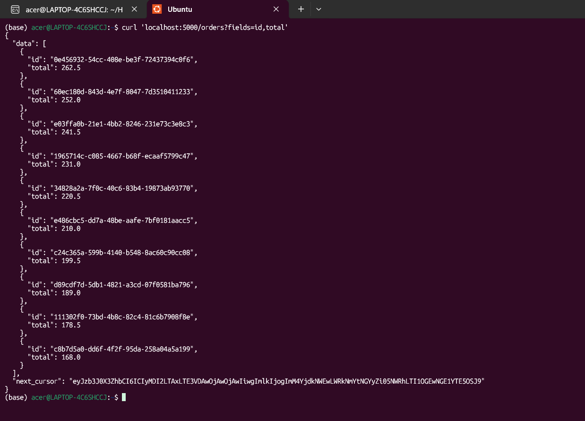
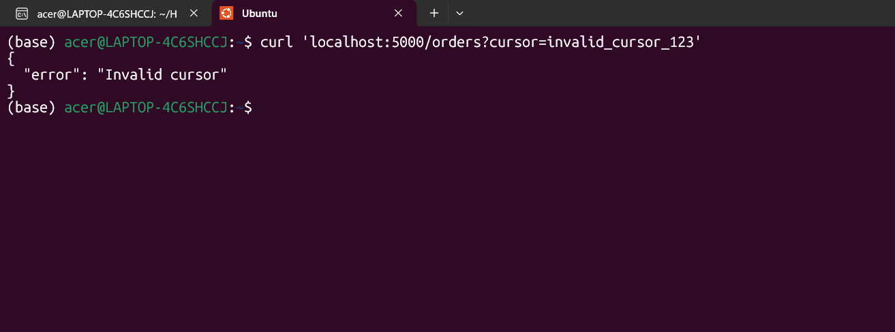
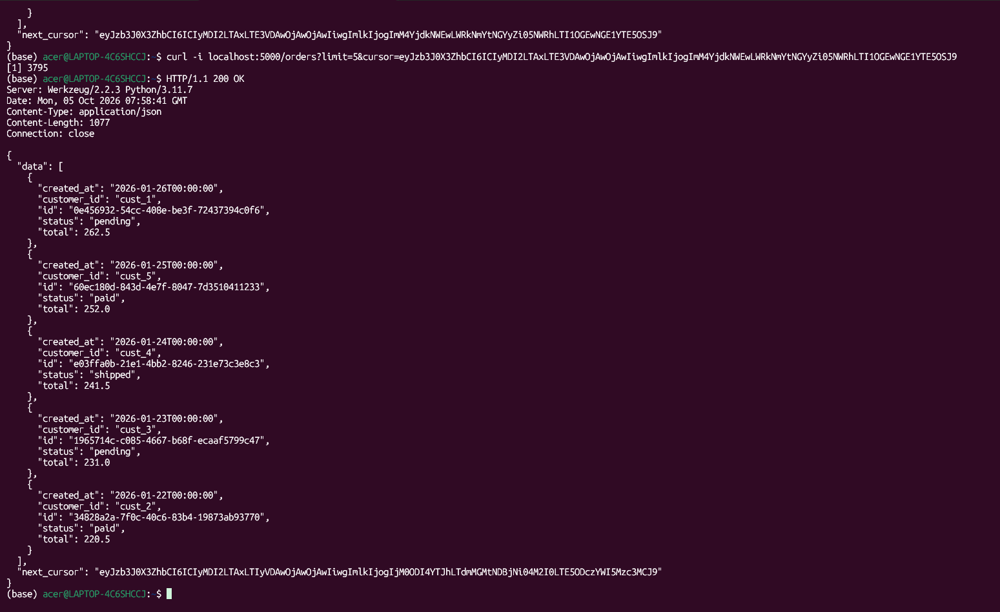

# Nộp bài tuần 4

## 1. Bài 1

Đăng bài viết ( POST post ) và lấy danh sách các bài viết ( GET posts )

Đăng comment vào bài viết có sẵn và đọc các comments của bài viết có sẵn 

## 2. Bài 2
Error handle trả về problem + json
* Viết error.py để tạo class ApiProblem và _problem
* sử dụng **@app.errorhandler() để bắt lỗi trong app2.py**

## 3. Bài 3
 Sử dụng mock data với 25 dữ liệu tự tạo để triển khai /orders có cursor pagination
 * Mặc định sắp xếp theo -created_at ( thời gian tạo giảm dần , tức là cái nào tạo sau cùng lên trước)
 * Mặc định limit = 10
 * Khi server gửi phản hồi , nếu có cusor ( tức trang tiếp theo ) gửi next_cursor ( phần tử cuối cùng của trang hiện tại )
 * client khi muốn mở trang tiếp theo , gửi next_cusor đã nhận để server trả lại trang tiếp theo
 * **cursor là bản mã hóa của id của một phần tử**

Chỉ trả về các đơn hàng có status="paid" và next_cursor = null

Trả về 5 đơn hàng đầu tiên kèm next_cursor

Trả về một số trường (sparse fields) , ở đây là id và total 

Cursor bị hỏng
* Cursor bị viết sai
* Tồn tại id được mã hóa thành cursor nhưng không nằm trong cách sắp xếp đó -> lỗi

Cursor hoạt động bình thường

