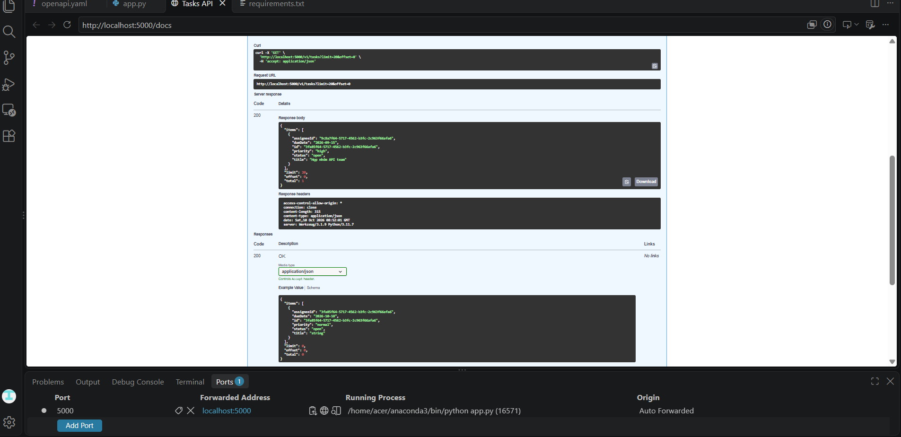

# Bài tập Buổi 4 — **API Specification và OpenAPI**

REST API quản lý task nội bộ, viết theo hướng **design-first**: đặc tả OpenAPI trước, sau đó implement Flask app khớp với đặc tả.

## Cài đặt & chạy

pip install -r requirements.txt
python app.py

| URL | Mô tả |
|---|---|
| http://localhost:5000/docs | Swagger UI |
| http://localhost:5000/openapi.json | Spec OpenAPI (JSON) |
| http://localhost:5000/v1 | Base URL của API |

## 5 Endpoints

| # | Method | Path | operationId | Mô tả |
|---|---|---|---|---|
| 1 | GET | /v1/tasks | listTasks | Liệt kê task (phân trang + lọc status) |
| 2 | POST | /v1/tasks | createTask | Tạo task mới |
| 3 | GET | /v1/tasks/{taskId} | getTaskById | Lấy chi tiết task |
| 4 | PATCH | /v1/tasks/{taskId} | patchTask | Cập nhật một phần task |
| 5 | DELETE | /v1/tasks/{taskId} | deleteTask | Xoá task |

## Screenshot

Swagger UI với nút **Try it out** gọi API thật và trả về response 200 OK:

## 2 quyết định thiết kế khó nhất

### 1. PATCH / POST dùng schema TaskInput riêng cho body , không dùng chung schema Task ( dành cho response )

**Vấn đề**

Nếu dùng chung schema Task cho cả response và request body, thì `id` (required trong Task) sẽ bị yêu cầu trong cả request — trong khi `id` phải do server tự sinh và client không được phép gửi.

**Quyết định**

Tách ra 3 schema riêng:
- Task — dùng cho response (có `id`, `status` là required)
- TaskInput — dùng cho request body (chỉ `title` required)  **không cần id**
- TaskPage — dùng cho response phân trang của GET /tasks

**Đánh đổi**

- Client gửi POST/PATCH ( cần request body)  không cần lo về `id` — chỉ gửi field cần thiết.
- Swagger UI hiển thị form đúng — không có ô `id` mờ ảo cho client điền.
- Thêm 1 schema phải maintain. Nếu muốn chặt hơn nữa (POST yêu cầu `title`, PATCH cho phép rỗng), phải tách CreateTaskInput và UpdateTaskInput — nhưng như vậy thêm 2 schema, không cần thiết cho bài tập.

---

### 2. Response phân trang dùng object TaskPage {items, total, limit, offset} thay vì mảng trần

**Vấn đề**

Nếu GET /tasks trả về mảng [Task, Task, ...]:
- Client không biết tổng cộng có bao nhiêu task → không hiển thị được "Trang 1/5".
- Client không biết server thực sự dùng `limit` và `offset` nào (vì có default) → không thể tính trang tiếp theo.

**Quyết định**

Trả object TaskPage với 4 field:

{
  "items": [ ... ],
  "total": 42,
  "limit": 20,
  "offset": 0
}

**Đánh đổi**

- Client có đủ metadata để build UI phân trang mà không phải đoán.
- Có thể mở rộng thêm field sau này (hasNext, nextCursor...) mà không breaking API — client cũ chỉ đọc field cũ, bỏ qua field mới.
- Response dài hơn 1 cấp: `response.items[0]` thay vì `response[0]`. Với API đơn giản có vẻ thừa, nhưng đây là chuẩn phổ biến cho API production (Stripe, GitHub, Twilio đều dùng).

---
